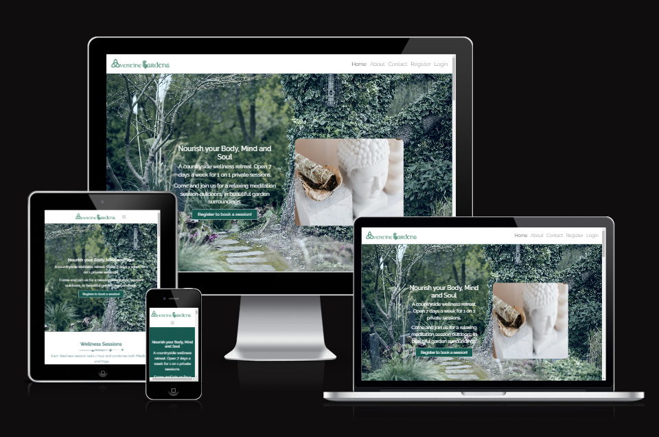

# Aventine Gardens



Welcome to Aventine Gardens! This website was built using Django, with custom Python, HTML and CSS. The website is for a local business, run from a manor house, offering daily sessions for anyone looking to improve their mental, spiritual and pyhsical health with daily sessions of Yoga and Meditation. Users will be able to create a profile, which then allows them to book their own appointments for their wellness sessions.

[Live link to Aventine Gardens](https://aventine-wellness-p4.herokuapp.com/)


<br>

# Table of Contents

1. [Features](#features)
    * [Home Page](#home-page)
      * [Wellness Section](#wellness-section)
      * [Benefits Section](#benefits-section)
      * [Instructors Section](#instructors-section)
    * [About Page](#about-page)
    * [Contact Page](#contact-page)
    * [Pages Restricted to Login](#restricted-pages)
      * [Booking](#booking-page)
      * [My Profile](#profile-page)
      * [Register](#register-page)
      * [Log Out](#log-out-page)
2. [Project Goals](#project-goals)
3. [User Stories](#user-stories)
4. [Agile Planning](#agile-planning)
4. [Design](#design)
5. [Technologies](#technologies)
    * [Languages Used](#languages-used)
    * [Libraries And Frameworks](#libraries-and-frameworks)
    * [Tools and Resources](#tools-and-resources)
6. [Testing](#testing)
    * [Validator Testing](#validator-testing)
    * [Other Testing](#other-testing)
7. [Bugs Found and Fixed](#bugs-found-and-fixed)
    * [Bugs Not Fixed](#bugs-not-fixed)
8. [Credits And Sources](#credits-and-sources)
9. [Deployment](#deployment)
10. [Acknowledgements](#acknowledgements)

# Features 

## Existing Features

### Home Page

- The home page features a hero image, with some text explaining the main purpose of the website and a small image to compliment the text.
- The index page is split into multiple sections, with the information easy to read and eye catching to a visitor.
- Along with this is a link. This link will ask the visitor to create a profile to book an apppointment if they're not logged in. If they are a logged in user, this link will instead suggest they book an appointment.


<br>

### Wellness Section

- The Wellness section of the index page explains what the booked sessions entail in a quick to read paragraph.
- Under this, there are 2 cards, with images and text, with a quick explanation of what Yoga and Meditation are.

<br>

### Benefits Section

- The benefits section of the home page provides some information to the user about how a wellness session can benefit their health, as well as provding a colour break up between large text sections.

<br>

### Instructors Section

- The Instructors section allows users to get a more peronal feel for the business by introducing them to the people they would likely meet if they booked a session.
- Each of the 3 instructors has a card with their name, photo and an explanation of their expertise in Yoga and Meditiation.

<br>

### About Page

- The About page gives the user a chance to learn more about both the Manor Hosue where the sessions will take place and what each session will entail.
- Information about both Yoga and Meditation are also shown, with links to credited sources about each for users to research themselves. 

<br>

### Contact Page

- The contact page features small icons with quick and easy to read information with a phone number, address and email.
- The page also hold a form for users to get in contact with the business. This form stores the posted information in the Admin panel, for staff to read easily.
- There is also directions on how to get to Aventine Gardens, as well as an embedded Google Map pointing to the business.


<br>

### Restricted Pages


- Some pages are restricted to logged in users only. Links to these only show in the Navbar when a user logged in also.

<br>

### Booking Page

- The Booking Page allows users to book an appointment, saved to their profile.
- Each day for the next 7 days has 4 appointments each to choose from.
- Booked appointments will show as buttons with the text "Booked" and those buttons will be disabled.
- Clicking a button to choose a timeslot will take you to a confirmation page. If a user doesn't want this time, they can return to the booking page and choose another or confirm the original appointment time shown.


<br>

### Profile Page


- The Profile page stores both the users information, as well as their appointments.
- The user can update their first name, last name and their booked appointments from here.


- Users can also delete their profile and their appointments from this page too. Each action has a confirmation tied to it.


- All of this is done with database information being created, read, updated and deleted (CRUD).

<br>

### Register Page

- The Register Page has a custom form, which asks users to provide a username, their full name and their email address and password.
- When these are entered, they're saved to a Profile database and the username, first name and last name all show on the Profile page of the logged in user.

<br>

### Log Out Page

- The log out page is another restricted page which asks the registered user to confirm they would like to log out of their account.


[Back to Top](#table-of-contents)

<br>

## Future Features

- There are definitely some features I would like to include, including better options for a registered user. Currently there is no way to reset a password or change an email address. I tried to implement these using AllAuth however I couldn't get the email system to work. More information about that is provided in the [Bugs](#bugs) section.
- I originally wanted to add an blog to the website which would be updated with the latest information about the business and would also allow Staff to add blog posts with some Yoga videos and wellness information. The reason for not implementing them at the current time was purely down to time contraints on an already massive project.

<br>

[Back to Top](#table-of-contents)

<br>

## Project Goals

* I wanted to create a website for a local business that offers something that I feel is beneficial to a huge range of people. This is a real business and I have worked with the owner in the past so felt I had some knowledge around what they would like to implement. Having an online presence will help their business massively.

* Learning how to create a booking system also seemed like a very good challenge and helped me learn about CRUD functionality better.

<br>

[Back to Top](#table-of-contents)

<br>

<!-- ## User Stories

* Users will:

  * Find information about a local business offering Yoga and Meditation sessions.
  * Be able to use the website across all devices with responsive design.
  * Be able to create, update and delete Profiles and Appointments for the business.

* Users expect:

  * A website that looks well across all devices.
  * A website that works well, with minimum errors encountered.

<br>

[Back to Top](#table-of-contents)

<br> -->

## **Agile Planning**

My Project was developed with agile planning. This meant that each individual feature was split first into User Stories for what the user of the website would expect. Each User Story was thought about and planned out, which allowed me to create multiple tasks which would be developed to implement certain features and these Tasks were then grouped together into Epics.

Everything was labeled as Must Have, Should Have, Could Have and Won't Have to help prioritise which were most important to implement.

As the main priority of the website, the booking system was started first and given the most time for completion. After that, as the project evolved, some more tasks were added or updated, based on the changing needs of a User within the website.

The Project board can be found [here](https://github.com/users/VictoriaT87/projects/5/views/1?visibleFields=%5B%22Title%22%2C%22Assignees%22%2C%22Status%22%2C%22Labels%22%5D).


### **Epic Breakdowns**
## **Epic 1: [Initial Install](https://github.com/VictoriaT87/P4-Aventine-Wellness/issues/1)**
> Allow Users to create/update/manage and delete user profiles

Broken down into these tasks:
- **Task: [Install Libraries and Frameworks](https://github.com/VictoriaT87/P4-Aventine-Wellness/issues/8)**
>Install: Django, gunicorn, dj-database, psycopg2
- **Task: [Hide sensitive information](https://github.com/VictoriaT87/P4-Aventine-Wellness/issues/9)**
> Hide sensitive information by creating an env.py file
- **Task: [Create Bookings App](https://github.com/VictoriaT87/P4-Aventine-Wellness/issues/10)**
>  Create bookings app

This Epic was the inital install of Django, gunicorn, dj-database and psycopg2 and the first App, Booking. This was the base platform on which the entire website would be built. The inital App for "booking" was created.


---

<br>

## **Epic 2: [Initial Deployment](https://github.com/VictoriaT87/P4-Aventine-Wellness/issues/2)**
> First deployment to the Heroku app once basic framework for the project is in place

Broken down into these tasks:
- **Task: [Heroku Deployment](https://github.com/VictoriaT87/P4-Aventine-Wellness/issues/11)**
> Create App in Heroku, Create Config Var files, Deploy from main branch
- **Task: [ElephantSQL Set up](https://github.com/VictoriaT87/P4-Aventine-Wellness/issues/12)**
>  Create Database URL in Elephant SQL, Add the Database URL to env.py and Heroku Config Vars

This Epic was for the inital deployment of the website to Heroku. This was undertaken as soon as the base packages, App and env.py file was set up and working correctly. Config Var files were created on Heroku for any sensitive information contained in the env.py file, as well as Port access needed.

---

<br>

## **Epic 3: [Databases](https://github.com/VictoriaT87/P4-Aventine-Wellness/issues/3)**
> Create database models in project app and migrate them

Broken down into the following task:
- **Task: [Create and Migrate Database](https://github.com/VictoriaT87/P4-Aventine-Wellness/issues/13)**
> Create and Migrate Database for Bookings App


This Epic was originally for the Booking app but was susequently reused when the project called for 2 new apps, Home and Profiles. Each time an app was created, a Model was also created.
- For Booking, the database model has everything needed to book a day and timeslot.
- For Home, a database model was created for the contact form which allowed the information submitted to be stored in the Admin panel for Staff to see the Contact Form information sent.
- For Profiles, a database model was created to store user information (first name and last name) and also linked to the User created with AllAuth.

---

<br>

## **Epic 4: [Admin Panel](https://github.com/VictoriaT87/P4-Aventine-Wellness/issues/4)**
> Add an admin panel to the project app to allow the admin to CRUD bookings

This was from the User Story:
#### **User Story: [Admin Panel](https://github.com/VictoriaT87/P4-Aventine-Wellness/issues/15)**
> As a Site Admin I can use an admin panel so that I can create, update, manage and delete bookings


This Epic was originally for the Booking app but was susequently reused when the project had 2 other apps, Home and Profiles. The Admin panel allows the site admin to manage booked appointments, contact form submissions and user profiles. All information for each of these can be seen, updated and removed from the database through the admin panel. Each App's admin.py file was also given some sort of display or search parameter, to make it easier for the site admin to find and sort information on the backend. 

---


## **Epic 5: [User Profiles](https://github.com/VictoriaT87/P4-Aventine-Wellness/issues/6)**
> Allow Users to create/update/manage and delete user profiles

This was from the User Story:
#### **User Story: [Create a Profile](https://github.com/VictoriaT87/P4-Aventine-Wellness/issues/18)**
> As a Site User I can create a profile so that I can add, manage and delete a booking

Which was down broken down into these tasks:
- **Task: [Create Account](https://github.com/VictoriaT87/P4-Aventine-Wellness/issues/22)**
> Allow a user to create an account on the website for the purpose of managing bookings
- **Task: [Update Account](https://github.com/VictoriaT87/P4-Aventine-Wellness/issues/24)**
> Allow a user to update all their profile information within their account and update database accordingly
- **Task: [Delete Account](https://github.com/VictoriaT87/P4-Aventine-Wellness/issues/23)**
> Allow a user to delete their account, add authorisation so this isn't done by accident

<br>

This User Story was implemented with the use of the AllAuth package, as well as a custom Profile Model, Form and Template. There is also a custom SignUp Form for when a user registers an account. The information the user enters in this is stored in the Admin panel, for SuperUsers/Staff to see and manage. Each User is assigned a User ID which allows for bookings to be assigned properly to each individual. Users can edit their profiles and delete them and this is all reflected in the database.

---

<br>

#### **Epic 6: [Bookings](https://github.com/VictoriaT87/P4-Aventine-Wellness/issues/7)**

>Create an app to allow users to book sessions with the yoga teacher


#### **Others**

-

<br>

## Design

- My starting point on this project was designing a flow chart based on the first story mission in Destiny The Game. To make the text adventure more fun, I added the random encounters and ability to choose ways to go and luck based weapons.


<br>

[Back to Top](#table-of-contents)

<br>

# Technologies

## Languages Used
* [Python](https://www.python.org/)

## Libraries And Frameworks
* [Google Sheets](https://www.google.com/sheets/about/)
* [gspread](https://docs.gspread.org/en/v5.7.0/)
* [Pyfiglet](https://pypi.org/project/pyfiglet/)
* [os](https://docs.python.org/3/library/os.html#os.system)
* [random](https://docs.python.org/3/library/random.html)
* [time](https://docs.python.org/3/library/time.html)

## Tools And Resources
* [GitPod](https://www.gitpod.io/)
* [GitHub](https://github.com/)
* [Heroku](https://heroku.com)
* [ReadMe Template](https://github.com/Code-Institute-Solutions/readme-template)
* [Lucid Chart](https://www.lucidchart.com/)
* [Stack Overflow](https://stackoverflow.com/)
* [Canva](https://www.canva.com/) for my README image.

<br>

[Back to Top](#table-of-contents)

<br>

# Testing 
### Validator Testing 

* All code passed through the CI Python Linter with no issues or warnings


 <br>


### Other Testing
 - For a list of all manual testing done and functions tested, please follow [this link](assets/documentation/testing.md).

 <br>


[Back to Top](#table-of-contents)

<br>

# Bugs Found and Fixed

 Below is a description of fixed bugs.

 ### get_name function - Length

  - #### Reason for fail:

    - User could input a name that was 1 or 2 characters long or an unlimited length.

  - #### Fix:

    - Add len(name.strip(" ")) to the function - user now needs to input a username between 3 characters and 8.

  ### get_subclass function - IndexError

  - #### Reason for fail:

    - Players need to enter a number - either 1, 2 or 3. However if they enter any other number, an error occurs "IndexError: list index out of range"

  - #### Fix:

    - I originally tried to use a range() for the input but I struggled with making this work because of the input containing an f-string. Upon further research, I realised I could add an if statement to my Try, to make sure the user input either 1, 2 or 3.

 

  <br>

  ### get_subclass function - Invalid Literal

  - #### Reason for fail:

    - Entering a string in the Subclass input was giving the error "invalid literal for int() with base 10"

  - #### Fix:

    - Researching this took me a long time. As I was enumerating the list for Subclass choices with an index (that starts at 0), I needed the input to be an int. I asked for help on both Reddit.com/LearnPython and StackOverflow and eventually figured out that with a Try statement, I could add a ValueError and an if statement to make sure the player entered a number between 1 and 3 and it wasn't a string.
    ``` 
    try:
        choice = int(input(f"\nMake your choice, {chosen_class}."
                "\n1, 2 or 3?\n>"))
        if choice < 1 or choice > 3 or choice == str():
            raise ValueError
        except ValueError:
          print("Please enter number 1, 2 or 3.")
    ```


<br>

### get_subclass function - Choices Not From Spreadsheet

  - #### Reason for fail:

    - When calling get_subclass, it was choosing the last game's choice, instead of the current one. 

  - #### Fix:

    - To fix, I passed the chosen_class parameter to get_subclass:
        - if player_class == "Hunter":
        - if chosen_class == "Hunter":

  <br>

  ### Else statements

  - #### Reason for fail:

    - If a player entered a choice that wasn't listed for certain options, the error message would print to the terminal. However, instead of repeating the choices, the game would then print a different function's questions.

  - #### Fix:

    - For this, I realised I needed to add the word "continue" within my Else statement. This made the code loop again if an incorrect option was entered.

  <br>


  <br>

  ### Player Health not clearing each run

  - #### Reason for fail:

    - Everytime the health function would run, it would choose a randint between 1 and 100. This would be removed from the players starting health of 100. However, if a player chose to re-run the game, the players health would stay as the negative number. This meant the player would always die at the Dreg Fight function.

  - #### Fix:

    - Add the code "guardian.health = 100" to the play_again function. This would reset it every time.


<br>

 ### dreg_fight() function not calling the correct values

  - #### Reason for fail:
  
    - The dreg_fight function was not calling the correct values.
    
  - #### Fix:
  
    - I had originally put the parameters in the function for the returned values of (chosen_class, chosen_subclass, abilities, weapon), however I realised that because of the different classes I have, this wasn't working. To fix it, I wrote local variables to pull the values from the spreadsheet instead.


<br>

 ### Object has no Attribute

  - #### Reason for fail:
  
    - When going through the story, some of the functions failed to run with the error "object has no attribute".
    
  - #### Fix:
  
    - Instead of calling the class, I was calling a 'self.' method. This worked for some versions of the adventure that the player chose but if the adventure went to the GameFunctions class back to the Story functions class, it wouldn't be able to find the correct object. To fix this, I wrote "GameFunctions.object(self, )" or "Story.object(self, )". This worked to fix the issue.


<br>

 ### Error Code 400 on gspread

  - #### Reason for fail:
  
    - When running the player_abilites function, I would get an error saying "gspread.exceptions.APIError: {'code': 400,..."
    
  - #### Fix:
  
    - Researching lead to me to understand that I had my possible abilites in a [list] and the google spreadsheet couldn't understand that. Removing them from a list and putting them in a Tuple fixed this error.

<br>

 ### Potentially compromised credentials 

  - Not a bug necessarily but a lesson learned. When creating a 2nd Heroku deployment, I used the same creds.json file as this and was informed by an email from Google, Github and Heroku that my key was compromised. I had to remake the key for this project as a result and update it on Heroku.


<br>

# Separated Project
 - After looking at some other Text Adventure games and talking over it with my Mentor, I decided to split the run.py files in separate ones for the sake of easy readability. This project worked as intended, however on first run when all imports were added, I got the error message: "AttributeError: partially initialized module has no attribute (most likely due to a circular import)". This was because my functions file was importing the story file and vice versa. This was fixed by adding "from ... import ..." statements.
 - The project being split into multiple separate files worked, however the loading time for it was a little over 10 seconds when deployed to Heroku. This made it feel like the program was hanging or just not working when the "Run Program" button was clicked in Heroku. Because of this, I decided to revert all my changes back into the single run.py file, however I made a new repo with the old files, and have linked it here: [Destiny RPG Multi-File](https://github.com/VictoriaT87/Destiny_RPG_Multi_File), as well as the deployed version here: [Destiny RPG Mutli-File Deplyed](https://destiny-multifile.herokuapp.com/)
 - I understand this is not going to be assessed, I just would personally like to keep it so I can perhaps figure out why it was so slow to load. My research lead me to believe this was either because of a cache issue or just some bottleneck I have in the code.

# Bugs Not Fixed
 - I would like the printed enumarate list in the get_subclass function to print to the terminal as slowly as the rest of the text. However, when I try to add function.s_print (to call the slow typing), it tells me I can't have both (index, subclass) in the method - "Too many positional arguments in method call". I have not found a fix for this.

<br>

[Back to Top](#table-of-contents)

<br>

# Credits and Sources

- The Project is built using the foundation from the [Elijah Henderson youtube videos on "Let's Make a Text Adventure Game In Python"](https://www.youtube.com/watch?v=HzDcKq2NDwM)
- The classes, subclasses, abilites, weapons and enemies are based on the video game [Destiny by Bungie](https://www.bungie.net/)
- The slow typing code was found on [StackOverflow.com](https://stackoverflow.com/questions/60608275/how-can-i-print-text-so-it-looks-like-its-being-typed-out)
- Clearing the terminal when starting the game or replaying was based on code found on [StackOverflow.com](https://stackoverflow.com/questions/2084508/clear-terminal-in-python)
- Random choice code was found on [Pynative.com](https://pynative.com/python-random-choice/)
- Code for enumerating the index and text in get_subclass was made with help from [GeeksforGeeks.org](https://www.geeksforgeeks.org/enumerate-in-python/)
- Getting the value from individual cells was found at [StackOverflow.com](https://stackoverflow.com/questions/19480449/reading-particular-cell-value-from-excelsheet-in-python)
- Deleting a certain row from the Google spreadsheet was found in [pythoninoffice.com](https://pythoninoffice.com/use-python-to-delete-excel-rows-columns/)
- Object Oriented Programming and Classes were learned on the [Tech With Tim Youtube Channel](https://www.youtube.com/watch?v=JeznW_7DlB0)
- Validation for entering a number in the get_subclass function was found at [StackOverflow.com](https://stackoverflow.com/questions/41832613/python-input-validation-how-to-limit-user-input-to-a-specific-range-of-integers)
- The fix to add a Try statement into the get_subclass function int(input()): [StackOverflow.com](https://stackoverflow.com/questions/71374555/prevent-error-on-intinput-that-is-a-string-and-prevent-negative-number-input) and [Programiz.com](https://www.programiz.com/python-programming/exception-handling)
- Raising a ValueError if player entered a string or the incorrect number in the get_subclass function [DigitalOcean.com](https://www.digitalocean.com/community/tutorials/python-valueerror-exception-handling-examples)

<br>

[Back to Top](#table-of-contents)

<br>

# Deployment

The following are the steps I went through to deploy my live site:

- The site was deployed using Heroku. The steps to deploy are as follows: 
1. Go to [Heroku](https://dashboard.heroku.com/apps)
2. Go to 'New' and select 'Create a new app'
3. Input your app name and create app.
4. Navigate to 'Settings'
5. Install the needed buildpacks. Select Python and install and then node.js and install and then click save. They must be in this order.
6. Navigate to the 'Deploy' section. 
7. Connect to GitHub, search for your repo and confirm. 
8. Choose branch to deploy.
9. Your app should now be available to see. You can choose whether to have your app automatically redeploy with every push or to keep it manual. 

- To Fork the repository:
  - On GitHub.com, navigate to the repository.
  - In the top-right corner of the page, click Fork.
  - Select an owner for the forked repository.
  - By default, forks are named the same as their parent repositories. You can change the name of the fork to distinguish it further.
  - Optionally, add a description of your fork.
  - Choose whether to copy only the default branch or all branches to the new fork.
  - Click Create fork.

- To Clone the repository:
  - On GitHub.com, navigate to the repository.
  - Above the list of files, click the Code button.
  - Copy the URL for the repository.
  - Open Git Bash.
  - Change the current working directory to the location where you want the cloned directory.
  - Type git clone, and then paste the URL you copied earlier.
  - Press Enter. Your local clone will be created.

<br>

The live link can be found here - [Destiny RPG Game](https://destiny-rpg.herokuapp.com/)

<br>

[Back to Top](#table-of-contents)

<br>

# Acknowledgements
- To my amazing boyfriend Thomas. For listening to me worry about this project for months, for keeping me sane, for helping me switch off after a long day with a cup of coffee and a bar of chocolate :)
- My family and my cats for keeping my stress levels under control!
- My Mentor [Jubril Akolade](https://github.com/Jubrillionaire) for all the help. His guidance was invaluable.
- [Sean Finn](https://github.com/seanf316/) and [Sean Johnston](https://github.com/seanj06/), my fellow classmates on Slack. Your help with my many questions was super appreciated, thank you.

<br>

[Back to Top](#table-of-contents)